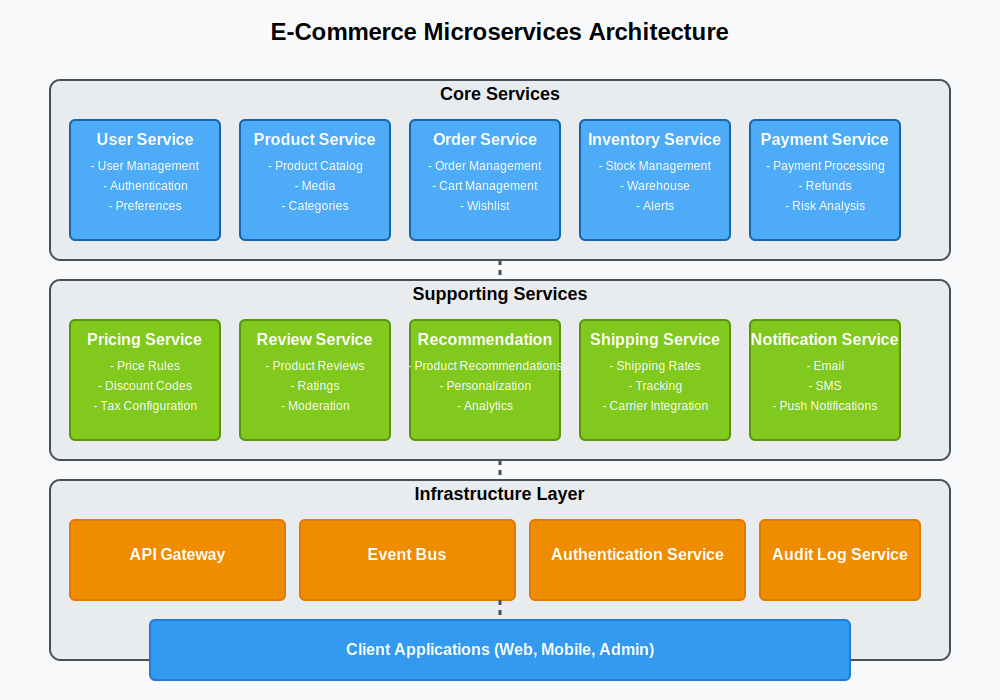

# E-Commerce Platform with Dynamic Pricing & Recommendation Engine

## 📌 Overview

A scalable e-commerce platform designed for **real-time inventory management**, **personalized product recommendations**, and **dynamic pricing** based on demand/competitor data. Built with a microservices architecture to ensure high availability and horizontal scalability.

---

### Architecture Diagram

---

## 🛠️ Tech Stack

| Category             | Technologies                                                             |
| -------------------- | ------------------------------------------------------------------------ |
| **Backend**          | Go (Golang) microservices                                                |
| **Databases**        | PostgreSQL (orders/users), Redis (product cache), Elasticsearch (search) |
| **Messaging**        | RabbitMQ (order processing, inventory sync)                              |
| **Authentication**   | JWT, bcrypt (password hashing)                                           |
| **Machine Learning** | Python (recommendations), TensorFlow Lite (dynamic pricing models)       |
| **Infrastructure**   | AWS EKS, Terraform (IaC), API Gateway                                    |
| **Monitoring**       | Grafana (dashboards), Prometheus (metrics)                               |
| **CI/CD**            | Github Action CI (pipelines)                                             |

---

## 🏗️ Architecture Breakdown

### 1. **Product Service**

- **Function**: Manages product catalog and search.
- **Components**:
  - **PostgreSQL**: Stores product metadata (SKU, descriptions, categories).
  - **Elasticsearch**: Powers real-time product search with fuzzy matching.
  - **Redis**: Caches frequently accessed product data (e.g., pricing, stock).
- **Sync**: Elasticsearch indexes updated via RabbitMQ events.

### 2. **Order Service**

- **Function**: Processes orders with idempotency to prevent duplicates.
- **Workflow**:
  1. Orders placed via API Gateway.
  2. RabbitMQ queues handle order processing (with retries for failures).
  3. PostgreSQL stores finalized orders; Redis tracks temporary reservations.
- **Idempotency**: Unique request IDs prevent duplicate charges.

### 3. **Recommendation Service**

- **Function**: Generates personalized product suggestions.
- **ML Pipeline**:
  - **Python**: Trains collaborative filtering models (user-item interactions).
  - **Go**: Serves lightweight TensorFlow Lite models via gRPC.
- **A/B Testing**: Routes traffic between models (v1 vs. v2) to optimize CTR.

### 4. **Pricing Service**

- **Function**: Adjusts prices dynamically using ML and competitor data.
- **Workflow**:
  - **TensorFlow Lite**: Predicts optimal prices based on demand/competitor scraping.
  - **Redis**: Caches current prices to reduce DB load.
  - **Updates**: Prices refreshed every 15 mins or on inventory changes.

### 5. **Payment Service**

- **Function**: Handles Stripe/PayPal integrations.
- **Features**:
  - Idempotency keys for failed retries.
  - AWS X-Ray traces payment gateway latency.
  - Circuit breakers to fail fast during provider outages.
- **Security**: JWT tokens validate user sessions; sensitive data encrypted.

### 6. **Inventory Service**

- **Function**: Manages stock levels and syncs across services.
- **Workflow**:
  - **RabbitMQ**: Listens for order events to decrement stock.
  - **Redis**: Caches stock levels for fast access.
  - **PostgreSQL**: Stores historical inventory data for analytics.

### 7. **User Service**

- **Function**: Manages user accounts and authentication.
- **Components**:
  - **PostgreSQL**: Stores user profiles, order history.
  - **Redis**: Caches user sessions for fast access.
  - **JWT**: Authenticates API requests with short-lived tokens.

---

## 🌐 Infrastructure

- **AWS EKS**: Kubernetes cluster auto-scaled with HPA (CPU/memory metrics).
- **Redis Cluster**: Multi-AZ setup for caching and rate limiting (100k RPM).
- **API Gateway**: Routes traffic to microservices with JWT validation.

---

## 🔄 CI/CD Pipeline

1. **Github Actions CI**:
   - Runs unit tests, and load tests with Locust.
   - Builds Docker images and pushes to AWS ECR.
2. **CD Pipeline**:
   - Deploys to EKS using Helm charts.
   - Blue/Green deployments for zero-downtime updates.
   - Rollback on failure (e.g., 5xx errors).
3. **Post-Deployment**:
   - Smoke tests validate critical paths (e.g., product search, checkout).

---

## 📊 Monitoring & Observability

| Tool           | Use Case                                            |
| -------------- | --------------------------------------------------- |
| **Prometheus** | Tracks order processing latency (P99 < 500ms).      |
| **Grafana**    | Dashboards for inventory levels, conversion rates.  |
| **Alerting**   | Slack/PagerDuty alerts for stockouts or 5xx errors. |

---

## 🚀 Unique Selling Points (USPs)

1. **Dynamic Pricing**: Real-time adjustments using ML + competitor data.
2. **Real-Time Inventory**: RabbitMQ syncs stock across services in <1s.
3. **A/B Testing**: Compare recommendation models (e.g., matrix factorization vs. neural).
4. **Cost Efficiency**: Spot instances on AWS EKS + Redis caching reduce infra costs by 40%.

---

## 🛑 Challenges & Solutions

| Challenge                  | Solution                                               |
| -------------------------- | ------------------------------------------------------ |
| **Inventory Over-Selling** | Redis atomic decrements + RabbitMQ dead-letter queues. |
| **ML Model Latency**       | TensorFlow Lite models optimized for <50ms inference.  |
| **Idempotent Payments**    | Idempotency keys stored in Redis (TTL 24h).            |

---

## 🔮 Future Roadmap

- Integrate Kafka for event-driven analytics (user behavior tracking).
- Expand ML models to include NLP-based product tagging.
- Multi-cloud deployment (GCP + AWS) for redundancy.
- Zero-downtime schema migrations for PostgreSQL.

### 📝 Contribution

Contributions are welcome! Please fork the repository and submit a pull request with your changes. Ensure to follow the coding standards and include tests for new features.

### 📜 License

This project is licensed under the MIT License. See the [LICENSE](LICENSE) file for details.

## 👥 Authors

👤 **Nicholas Emmanuel**

- GitHub: [@NickEmma](https://github.com/NickEmma)
- Twitter: [@techieEmma](https://twitter.com/techieEmma)
- LinkedIn: [@Nicholas Emmanuel](https://www.linkedin.com/in/techieemma/)
- Website: [Nicholas Emmanuel](https://techieemma.me)

👤 **Samuel Agbana**

- GitHub: [@starktrix](https://github.com/starktrix)
- Twitter: [@starktrix](https://twitter.com/starktrixnet)
- LinkedIn: [@Samuel Agbana](https://www.linkedin.com/in/starktrix/)
- Website: [Samuel Agbana](https://starktrix.me)
